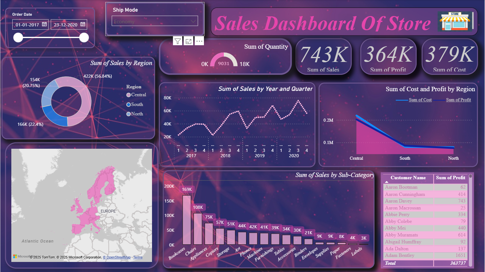

# 📊 Store Sales Dashboard

**Repository Name:** `Store-Sales-Dashboard`  
**Description:** Power BI project visualizing and analyzing retail store sales data, providing insights into sales, profit, costs, and product performance across regions and categories.

---

  

---

## 📝 Project Overview
This Power BI dashboard allows users to explore **store sales performance** over time and by category.  
It provides an interactive view of **Sales, Profit, Cost, and Quantity Sold** using various Power BI visuals.

---

## 📈 Dashboard Highlights
- **Sum of Sales by Region** → Donut Chart  
- **Sum of Sales by Year and Quarter** → Line Chart  
- **Sum of Cost and Profit by Region** → Area Chart  
- **Sum of Sales by Sub-Category** → Bar Chart  
- **Customer-wise Profit Table**  
- **Map Visualization** → Regional Sales Distribution  
- **Filters/Slicers** → Order Date & Ship Mode  

---

## 🧮 Key Metrics
| Metric | Value |
|--------|-------|
| Total Sales | 743K |
| Total Profit | 364K |
| Total Cost | 379K |
| Quantity Sold | 9031 |

---

## 💡 Insights
- The **Central Region** generated the highest sales (~57%).  
- **Bookcases** and **Chairs** are the top-selling sub-categories.  
- **Profit and Cost** trends show regional differences.  
- Sales **steadily increased** from 2017 to 2020, showing growth.

---

## 🧰 Tech Stack
- **Power BI Desktop** – Data visualization  
- **Microsoft Excel** – Source dataset  
- **DAX** – For calculations  
- **Power Query Editor** – Data cleaning and transformation  

---

## 📁 Project Files
| File Name | Description |
|-----------|-------------|
| `Store_Sales_Data.xlsx` | Dataset used for analysis (Retail Store Sales Data) |
| `Sales_Dashboard.pbix` | Power BI dashboard file |
| `Sales_Dashboard.png` | Dashboard preview image |
| `README.md` | Project documentation |

---

## 🚀 How to Use
1. Download the repository.  
2. Open `Sales_Dashboard.pbix` in **Power BI Desktop**.  
3. Connect `Store_Sales_Data.xlsx` as the data source.  
4. Explore visuals and apply filters interactively.

---

## 👨‍💻 Author
**Shrikant Nevase**  
*Aspiring Data Analyst | Power BI & ML Enthusiast*  
[GitHub Profile](https://github.com/your-username)

---

## 🏷️ Tags
`#PowerBI` `#RetailSales` `#DataVisualization` `#BusinessAnalytics` `#ExcelData` `#DAX`

---

⭐ If you like this project, give it a star on GitHub!
